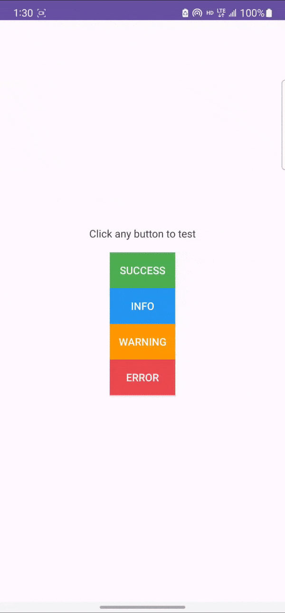

# Alerter for Android
[](https://jitpack.io/#pisalcoding/alerter)

<div style="text-align:center; width: 100%;">
   
</div>

## Get Started with Gradle’s Kotlin DSL
> Step 1: Add this your root settings.gradle.kts
```java
dependencyResolutionManagement {
     maven("https://jitpack.io")
}

```
> Step 2: Add this your app build.gradle.kts
```java
dependencies {
	implementation("com.github.pisalcoding:alerter:v1.0.0-alpha")
}
```

## OR Get Started with Legacy Gradle
> Step 1: Add this your root build.gradle
```java
repositories {  
    maven { url "https://jitpack.io" }
}

```
> Step 2: Add this your app build.gradle
```java
dependencies {
	implementation 'com.github.pisalcoding:alerter:v1.0.0-alpha'
}
```

## Usage

### Simple
Call the library from your activity or fragment
```kotlin
Alerter.success()
    .withTitle("Success")
    .withMessage("Congratulations!")
    .show(supportFragmentManager, "Tag")
```

### With some customization 
```kotlin
Alerter.info()
    .withTitle("Tips")
    .withMessage("Look away from your screens every 20 minutes.")
    .setIconDrawable(
        ResourcesCompat.getDrawable(resources, drawable.round_check_circle_24, theme)
    )
    .setTimeoutMillis(4000)
    .setOnDismissListener {
        // Do something after dialog is dismissed
    }
    .show(supportFragmentManager, "Tag")
```


